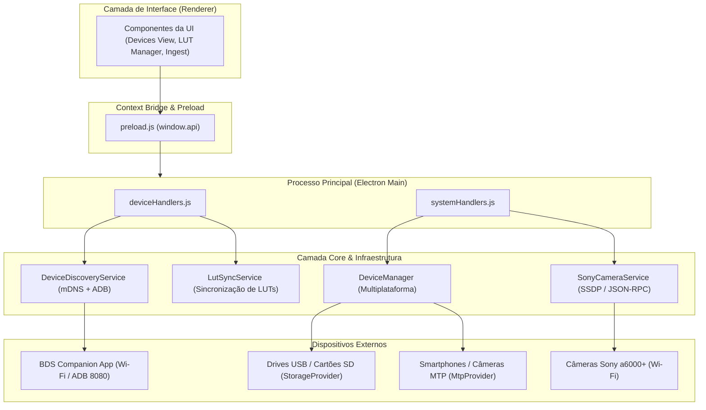

# 🔌 Documentação da API de Conexão de Dispositivos

> **Braga Digital Studio (BDS)** — Arquitetura de Conexão, Detecção, Transferência e Sincronização de Dispositivos de Hardware e Mobile.

---

## 📑 Sumário

1. [Visão Geral e Arquitetura](#1-visão-geral-e-arquitetura)
2. [Tipos de Dispositivos Suportados](#2-tipos-de-dispositivos-suportados)
3. [API do Renderer (`window.api` via Preload)](#3-api-do-renderer-windowapi-via-preload)
   - 3.1. [Armazenamento USB e Drives Removíveis](#31-armazenamento-usb-e-drives-removíveis)
   - 3.2. [Dispositivos Portáteis MTP (Windows/Linux)](#32-dispositivos-portáteis-mtp-windowslinux)
   - 3.3. [Dispositivos BDSM (Companion Mobile Wi-Fi / ADB)](#33-dispositivos-bdsm-companion-mobile-wi-fi--adb)
   - 3.4. [Câmeras Sony (Sony Camera Remote API)](#34-câmeras-sony-sony-camera-remote-api)
4. [Canais IPC do Electron (`ipcMain` / `ipcRenderer`)](#4-canais-ipc-do-electron-ipcmain--ipcrenderer)
5. [Protocolo BDSM REST (Comunicação Mobile ↔ Desktop)](#5-protocolo-bdsm-rest-comunicação-mobile--desktop)
6. [Camada de Infraestrutura e Serviços Backend](#6-camada-de-infraestrutura-e-serviços-backend)
7. [Tratamento de Eventos e Ciclo de Vida](#7-tratamento-de-eventos-e-ciclo-de-vida)

---

## 1. Visão Geral e Arquitetura

O sistema de conexão de dispositivos do **Braga Digital Studio** foi projetado com uma arquitetura modular em camadas, garantindo compatibilidade multiplataforma (Windows e Linux/macOS) e suporte a múltiplos protocolos físicos e de rede:



---

## 2. Tipos de Dispositivos Suportados

| Tipo | Protocolo / Transporte | Mecanismo de Descoberta | Casos de Uso |
|---|---|---|---|
| **USB Storage** | Mass Storage (FAT32/exFAT/NTFS) | Sondagem de volumes de disco do SO | Cartões SD, Pen Drives, SSDs externos |
| **MTP** | Media Transfer Protocol (WPD/libmtp) | Enumeração de Dispositivos Portáteis | Celulares Android, Gravadores, Câmeras |
| **BDSM Mobile** | HTTP REST + JSON | mDNS Bonjour (`_bdsm._tcp`) / ADB Port Forward | BDS Companion App, Transferência de Mídia, Sincronização de LUTs 3D |
| **Sony Camera** | SSDP + Sony Camera Remote API (JSON-RPC) | Descoberta UPnP/SSDP via UDP + Fallback IP direto (192.168.122.1:8080) | Importação de fotos e vídeos (RAW .ARW, JPG, MP4) com download separado, telemetria em tempo real (bateria e armazenamento) e ingestão automática no pipeline da Library |

---

## 3. API do Renderer (`window.api` via Preload)

Todas as chamadas abaixo estão expostas de forma segura no contexto do Renderer através do objeto global `window.api`.

### 3.1. Armazenamento USB e Drives Removíveis

#### `getAllDevices(force = false)`
Enumera todos os dispositivos de armazenamento USB/SD e MTP conectados.
- **Assinatura:** `window.api.getAllDevices(force?: boolean): Promise<{ success: boolean, devices: Array<DeviceInfo> }>`
- **Retorno:**
  ```typescript
  interface DeviceInfo {
    id: string;
    name: string;
    type: 'usb' | 'mtp' | 'bdsm';
    path?: string;
    mountPoint?: string;
    size?: number;
    free?: number;
  }
  ```

#### `listUsbFolder(basePath, pathArray)`
Lista pastas e arquivos de um dispositivo de armazenamento em massa.
- **Assinatura:** `window.api.listUsbFolder(basePath: string, pathArray: string[]): Promise<{ success: boolean, items: Array<FileItem> }>`

#### `importUsbItems(basePath, pathArray, itemNames, destFolder)`
Copia arquivos selecionados do drive USB para a pasta de destino do projeto.
- **Assinatura:** `window.api.importUsbItems(basePath: string, pathArray: string[], itemNames: string[], destFolder: string): Promise<boolean>`

---

### 3.2. Dispositivos Portáteis MTP (Windows/Linux)

#### `listMtpFolder(deviceName, pathArray)`
Navega e lista a estrutura de pastas do dispositivo MTP conectado.
- **Assinatura:** `window.api.listMtpFolder(deviceName: string, pathArray: string[]): Promise<Array<MtpItem>>`

#### `importMtpItems(deviceName, pathArray, itemNames, destFolder)`
Transfere arquivos do dispositivo MTP para o disco local.
- **Assinatura:** `window.api.importMtpItems(deviceName: string, pathArray: string[], itemNames: string[], destFolder: string): Promise<boolean>`

#### Evento de Progresso MTP: `onMtpProgress(callback)`
- **Assinatura:** `window.api.onMtpProgress((data: { completed: number, total: number, current: string }) => void): () => void`

---

### 3.3. Dispositivos BDSM (Companion Mobile Wi-Fi / ADB)

#### Eventos de Descoberta Automática
- `window.api.onBdsmDeviceAdded(callback: (device: BdsmDevice) => void)`
- `window.api.onBdsmDeviceRemoved(callback: (deviceId: string) => void)`
- `window.api.onBdsmDeviceUpdated(callback: (device: BdsmDevice) => void)`

Estrutura do objeto `BdsmDevice`:
```json
{
  "id": "Galaxy S24 Ultra - Camera A_wifi",
  "name": "Galaxy S24 Ultra - Camera A",
  "model": "SM-S928B",
  "ip": "192.168.1.105",
  "port": 8080,
  "battery": 85,
  "storage_total": 536870912000,
  "storage_free": 214748364800,
  "app_version": "1.0.0",
  "connection": "wifi",
  "type": "bdsm",
  "last_seen": 1755819600000
}
```

#### `getBdsmMedia(ip, port)`
Obtém o catálogo de mídias disponíveis no dispositivo.
- **Assinatura:** `window.api.getBdsmMedia(ip: string, port: number): Promise<Array<MediaItem>>`

#### `getBdsmImportHistory(deviceId)`
Consulta o histórico local de arquivos já importados deste dispositivo (evita duplicatas).
- **Assinatura:** `window.api.getBdsmImportHistory(deviceId: string): Promise<string[]>`

#### `importBdsmMedia(options)`
Faz o download em lote de mídias do celular para o projeto.
- **Assinatura:** 
  ```typescript
  window.api.importBdsmMedia(options: {
    ip: string;
    port: number;
    deviceId: string;
    items: Array<{ id: string, name: string, hash?: string }>;
    destFolder: string;
    projectId?: string;
  }): Promise<number>
  ```

#### Sincronização de LUTs 3D (.cube)
- `window.api.analyzeBdsmLutSync(ip: string, port: number): Promise<LutSyncPlan>`
- `window.api.executeBdsmLutSync(options: { ip: string, port: number, plan: LutSyncPlan }): Promise<boolean>`
- `window.api.onBdsmLutSyncProgress(callback: (progress: LutSyncProgress) => void)`

---

### 3.4. Câmeras Sony (Sony Camera Remote API & Ingestão)

- `window.api.sonyList(cameraId: string, options?: { uri?: string, cnt?: number, view?: string }): Promise<Array<SonyMediaItem>>`
- `window.api.sonyBrowse(cameraId: string, uri: string): Promise<Array<SonyMediaItem>>`
- `window.api.sonyGetStatus(cameraId: string): Promise<SonyDeviceStatus>`
- `window.api.sonyImportItems(cameraId: string, items: Array<SonyMediaItem>, destFolder: string): Promise<string[]>`
- **Eventos:**
  - `window.api.onSonyImportProgress(callback: (progress: { currentItem: string, itemIndex: number, totalItems: number, percent: number, downloaded: number, total: number }) => void)`
  - `window.api.onSonyStatusUpdated(callback: (status: SonyDeviceStatus) => void)`

---

## 4. Canais IPC do Electron (`ipcMain` / `ipcRenderer`)

| Canal IPC | Tipo | Payload de Entrada | Retorno / Emissão |
|---|---|---|---|
| `devices:get-all` | `invoke` | `force: boolean` | `{ success: boolean, devices: Array }` (MTP, USB, BDSM, SONY) |
| `usb:list-folder` | `invoke` | `basePath, pathArray` | `{ success: boolean, items: Array }` |
| `usb:import-items`| `invoke` | `basePath, pathArray, itemNames, destFolder` | `boolean` |
| `mtp:list-folder` | `invoke` | `deviceName, pathArray` | `Array<Item>` |
| `mtp:import-items`| `invoke` | `deviceName, pathArray, itemNames, destFolder` | `boolean` |
| `sony:list`       | `invoke` | `cameraId, options` | `Array<SonyMediaItem>` |
| `sony:browse`     | `invoke` | `cameraId, uri` | `Array<SonyMediaItem>` |
| `sony:get-status` | `invoke` | `cameraId` | `SonyDeviceStatus` |
| `sony:import-items` | `invoke` | `{ cameraId, items, destFolder }` | `Array<string>` (arquivos importados) |
| `sony:import-progress` | `send (event)` | — | `{ currentItem, itemIndex, totalItems, percent, downloaded, total }` |
| `sony:camera_connected` | `send (event)` | — | `SonyCameraInfo` |
| `sony:status_updated` | `send (event)` | — | `SonyDeviceStatus` |
| `bdsm:getMedia`   | `invoke` | `ip, port` | `Array<MediaItem>` |
| `bdsm:importMedia`| `invoke` | `{ ip, port, deviceId, items, destFolder, projectId }` | `completedCount` |
| `bdsm:analyzeLutSync` | `invoke` | `ip, port` | `LutSyncPlan` |
| `bdsm:executeLutSync` | `invoke` | `{ ip, port, plan }` | `boolean` |
| `bdsm:device_added`   | `send (event)` | — | `BdsmDevice` |
| `bdsm:device_removed` | `send (event)` | — | `deviceId` |
| `bdsm:progress`       | `send (event)` | — | `{ completed, total, current }` |
| `bdsm:lutSyncProgress`| `send (event)` | — | `{ step, percent, file }` |

---

## 5. Protocolo BDSM REST (Comunicação Mobile ↔ Desktop)

Quando um aplicativo móvel (Android/iOS) atua como dispositivo compatível BDSM, ele expõe um servidor HTTP local na porta `8080` com as seguintes rotas:

```
[Mobile / Camera Device: 8080]
  ├── GET  /api/discovery/info     -> Informações do hardware, bateria e armazenamento
  ├── GET  /api/media              -> Catálogo de fotos e vídeos disponíveis
  ├── GET  /api/media/:id/download -> Stream binário do arquivo
  ├── GET  /api/media/:id/thumbnail-> Miniatura da imagem/vídeo
  ├── DEL  /api/media/:id          -> Exclusão de mídia após importação
  ├── GET  /api/luts               -> Lista de LUTs .cube instaladas
  ├── POST /api/luts/upload        -> Envio multipart/form-data de nova LUT
  └── DEL  /api/luts/:path         -> Exclusão de LUT do dispositivo
```

### Headers Obrigatórios
- `X-BDSM-Client`: `BragaDigitalStudio-Desktop`
- `X-BDSM-Version`: `1.0`
- `Accept`: `application/json`

---

## 6. Camada de Infraestrutura e Serviços Backend

1. **`DeviceDiscoveryService`** (`src/core/devices/DeviceDiscoveryService.js`):
   - Inicializa o `Bonjour` para escutar serviços `_bdsm._tcp`.
   - Executa `adb forward tcp:8080 tcp:8080` para túnel USB automático.
   - Realiza polling periódico a cada 5 segundos para sondar `127.0.0.1:8080` e IPs Wi-Fi.
   - Dispara eventos de `device_added`, `device_updated` e `device_removed` (após timeout de 15s offline).

2. **`DeviceManager`** (`src/infrastructure/hardware/DeviceManager.js`):
   - Padrão **Facade** que delega operações aos provedores específicos de SO (`WindowsStorageProvider`, `WindowsMtpProvider`, `LinuxStorageProvider`, `LinuxMtpProvider`).

3. **`BdsmClient`** (`src/core/devices/BdsmClient.js`):
   - Cliente HTTP que encapsula as requisições REST para o dispositivo remoto com tratamento de falhas e streaming de download.

4. **`LutSyncService`** (`src/core/devices/LutSyncService.js`):
   - Compara as LUTs locais do BDS (`data/LUTs`) com as LUTs do dispositivo mobile via hash SHA-256 e executa planos de sincronização bidirecional.

---

## 7. Tratamento de Eventos e Ciclo de Vida

No Frontend (Renderer), registre e limpe os listeners para evitar vazamentos de memória:

```javascript
// Exemplo de Inscrição no Renderer
const cleanupDeviceAdded = window.api.onBdsmDeviceAdded((device) => {
  console.log('Novo dispositivo detectado:', device.name, device.connection);
  atualizarListaDispositivos();
});

const cleanupProgress = window.api.onBdsmProgress(({ completed, total, current }) => {
  console.log(`Importando ${current}: ${completed}/${total}`);
});

// Ao desmontar a tela / componente:
// window.api.removeAllListeners(); ou executar os callbacks de cleanup retornados
```

---

*Documento gerado para o ecossistema Braga Digital Studio (BDS).*
