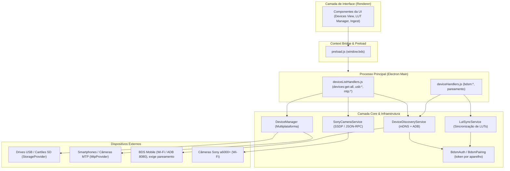

# 🔌 Documentação da API de Conexão de Dispositivos

> **Braga Digital Studio (BDS)** — Arquitetura de Conexão, Detecção, Transferência e Sincronização de Dispositivos de Hardware e Mobile.

---

## 📑 Sumário

1. [Visão Geral e Arquitetura](#1-visão-geral-e-arquitetura)
2. [Tipos de Dispositivos Suportados](#2-tipos-de-dispositivos-suportados)
3. [API do Renderer (`window.bds` via Preload)](#3-api-do-renderer-windowbds-via-preload)
   - 3.1. [Armazenamento USB e Drives Removíveis](#31-armazenamento-usb-e-drives-removíveis)
   - 3.2. [Dispositivos Portáteis MTP (Windows/Linux)](#32-dispositivos-portáteis-mtp-windowslinux)
   - 3.3. [Dispositivos BDSM (Companion Mobile Wi-Fi / ADB)](#33-dispositivos-bdsm-companion-mobile-wi-fi--adb)
   - 3.4. [Câmeras Sony (Sony Camera Remote API)](#34-câmeras-sony-sony-camera-remote-api)
4. [Canais IPC do Electron (`ipcMain` / `ipcRenderer`)](#4-canais-ipc-do-electron-ipcmain--ipcrenderer)
5. [Protocolo BDSM REST (Comunicação Mobile ↔ Desktop)](#5-protocolo-bdsm-rest-comunicação-mobile--desktop)
6. [Camada de Infraestrutura e Serviços Backend](#6-camada-de-infraestrutura-e-serviços-backend)
7. [Tratamento de Eventos e Ciclo de Vida](#7-tratamento-de-eventos-e-ciclo-de-vida)

---

## 1. Visão Geral e Arquitetura

O sistema de conexão de dispositivos do **Braga Digital Studio** foi projetado com uma arquitetura modular em camadas, garantindo compatibilidade multiplataforma (Windows e Linux/macOS) e suporte a múltiplos protocolos físicos e de rede:


```mermaid
flowchart TB
    subgraph UI ["Camada de Interface (Renderer)"]
        UIComp["Componentes da UI (Devices View, LUT Manager, Ingest)"]
    end

    subgraph Bridge ["Context Bridge & Preload"]
        Preload["preload.js (window.bds)"]
    end

    subgraph IPC ["Processo Principal (Electron Main)"]
        DeviceListHandlers["deviceListHandlers.js (devices:get-all, usb:*, mtp:*)"]
        DeviceHandlers["deviceHandlers.js (bdsm:*, pareamento)"]
    end

    subgraph Core ["Camada Core & Infraestrutura"]
        DM["DeviceManager (Multiplataforma)"]
        DDS["DeviceDiscoveryService (mDNS + ADB)"]
        Auth["BdsmAuth / BdsmPairing (token por aparelho)"]
        Sony["SonyCameraService (SSDP / JSON-RPC)"]
        LutSync["LutSyncService (Sincronização de LUTs)"]
    end

    subgraph Hardware ["Dispositivos Externos"]
        USB["Drives USB / Cartões SD (StorageProvider)"]
        MTP["Smartphones / Câmeras MTP (MtpProvider)"]
        BDSM["BDS Mobile (Wi-Fi / ADB 8080), exige pareamento"]
        SonyCam["Câmeras Sony a6000+ (Wi-Fi)"]
    end

    UIComp --> Preload
    Preload --> IPC
    DeviceHandlers --> DDS & LutSync
    DeviceListHandlers --> DM & DDS & Sony
    DM --> USB & MTP
    DDS --> BDSM
    LutSync --> Auth
    DDS --> Auth
    Sony --> SonyCam
```

---

## 2. Tipos de Dispositivos Suportados

| Tipo | Protocolo / Transporte | Mecanismo de Descoberta | Casos de Uso |
|---|---|---|---|
| **USB Storage** | Mass Storage (FAT32/exFAT/NTFS) | Sondagem de volumes de disco do SO | Cartões SD, Pen Drives, SSDs externos |
| **MTP** | Media Transfer Protocol (WPD/libmtp) | Enumeração de Dispositivos Portáteis | Celulares Android, Gravadores, Câmeras |
| **BDSM Mobile** | HTTP REST + JSON, com **pareamento** (token) | mDNS Bonjour (`_bdsm._tcp`) / ADB Port Forward | App BDS Mobile: importação de gravações e envio de LUTs 3D. USB tem prioridade sobre Wi-Fi do mesmo aparelho |
| **Sony Camera** | SSDP + Sony Camera Remote API (JSON-RPC) | Descoberta UPnP/SSDP via UDP + Fallback IP direto (192.168.122.1:8080) | Importação de fotos e vídeos (RAW .ARW, JPG, MP4) com download separado, telemetria em tempo real (bateria e armazenamento) e ingestão automática no pipeline da Library |

---

## 3. API do Renderer (`window.bds` via Preload)

Todas as chamadas abaixo estão expostas de forma segura no contexto do Renderer através do objeto global `window.bds`.

### 3.1. Armazenamento USB e Drives Removíveis

#### `getAllDevices(force = false)`
Enumera todos os dispositivos de armazenamento USB/SD e MTP conectados.
- **Assinatura:** `window.bds.getAllDevices(force?: boolean): Promise<Array<DeviceInfo>>`
- **Retorno:** um array; cada item tem `type` `'MTP'`, `'USB'`, `'BDSM'` ou `'SONY'` (maiúsculas) e os campos do respectivo provedor (ex.: `storage`, `Storages`, `ip`, `battery`).

#### `listUsbFolder(basePath, pathArray)`
Lista pastas e arquivos de um dispositivo de armazenamento em massa.
- **Assinatura:** `window.bds.listUsbFolder(basePath: string, pathArray: string[]): Promise<{ success: boolean, items: Array<FileItem> }>`

#### `importUsbItems(basePath, pathArray, itemNames, destFolder)`
Copia arquivos selecionados do drive USB para a pasta de destino do projeto.
- **Assinatura:** `window.bds.importUsbItems(basePath: string, pathArray: string[], itemNames: string[], destFolder: string): Promise<boolean>`

---

### 3.2. Dispositivos Portáteis MTP (Windows/Linux)

#### `listMtpFolder(deviceName, pathArray)`
Navega e lista a estrutura de pastas do dispositivo MTP conectado.
- **Assinatura:** `window.bds.listMtpFolder(deviceName: string, pathArray: string[]): Promise<Array<MtpItem>>`

#### `importMtpItems(deviceName, pathArray, itemNames, destFolder)`
Transfere arquivos do dispositivo MTP para o disco local.
- **Assinatura:** `window.bds.importMtpItems(deviceName: string, pathArray: string[], itemNames: string[], destFolder: string): Promise<boolean>`

#### Evento de Progresso MTP: `onMtpProgress(callback)`
- **Assinatura:** `window.bds.onMtpProgress((data: { completed: number, total: number, current: string }) => void): () => void`

---

### 3.3. Dispositivos BDSM (Companion Mobile Wi-Fi / ADB)

#### Eventos de Descoberta Automática
Um celular só aparece **uma vez**: se responde por USB e por Wi-Fi, só a conexão USB é listada (`physicalId` igual = `"deviceName|deviceModel"`); a Wi-Fi volta se o cabo sair.

- `window.bds.onBdsmDeviceAdded(callback: (device: BdsmDevice) => void)`
- `window.bds.onBdsmDeviceRemoved(callback: (deviceId: string) => void)`
- `window.bds.onBdsmDeviceUpdated(callback: (device: BdsmDevice) => void)`

Estrutura do objeto `BdsmDevice` (nunca contém token):
```json
{
  "id": "Galaxy S24 Ultra - Camera A_wifi",
  "name": "Galaxy S24 Ultra - Camera A",
  "model": "SM-S928B",
  "ip": "192.168.1.105",
  "port": 8080,
  "battery": 85,                      // null enquanto não pareado
  "storage_total": 536870912000,      // 0 enquanto não pareado
  "storage_free": 214748364800,
  "app_version": "1.0.0",
  "paired": true,
  "authRequired": true,
  "physicalId": "Galaxy S24 Ultra - Camera A|SM-S928B",
  "connection": "wifi",
  "type": "bdsm",
  "last_seen": 1755819600000
}
```

#### `getBdsmMedia(ip, port)`
Obtém o catálogo de mídias disponíveis no dispositivo.
- **Assinatura:** `window.bds.getBdsmMedia(ip: string, port: number): Promise<Array<MediaItem>>`
- **MediaItem:** `{ id, name, size, duration (s), width, height, fps, codec, createdAt }` (o celular usa `filename`/`filesize`; o main converte).
- Sem pareamento lança `BDSM:PAIRING_REQUIRED:...` (ver abaixo).

#### `getBdsmImportHistory(deviceId)`
Consulta o histórico local de arquivos já importados deste dispositivo (evita duplicatas).
- **Assinatura:** `window.bds.getBdsmImportHistory(deviceId: string): Promise<string[]>`

#### `importBdsmMedia(options)`
Faz o download em lote de mídias do celular para o projeto.
- **Assinatura:** 
  ```typescript
  window.bds.importBdsmMedia(options: {
    ip: string;
    port: number;
    deviceId: string;
    items: Array<{ id: string, name: string, hash?: string }>;
    destFolder: string;
    projectId?: string;
  }): Promise<number>
  ```

#### Pareamento (o token fica só no processo principal)
- `window.bds.getBdsmPairingStatus(ip, port): Promise<{ deviceName, deviceModel, paired, authRequired, tokenRejected }>`
- `window.bds.startBdsmPairing(ip, port): Promise<{ state: 'PENDING', code, secondsLeft } | { state: 'APPROVED', alreadyPaired: true }>`: pede ao celular e devolve o código de 4 dígitos para o usuário conferir no aparelho.
- `window.bds.onBdsmPairing(cb: ({ ip, port, state, code, secondsLeft, errorCode?, message? }) => void)`: andamento (`PENDING`, `APPROVED`, `DENIED`, `EXPIRED`, `ERROR`, `CANCELED`); o main consulta o celular a cada 1,5 s.
- `window.bds.cancelBdsmPairing(ip, port)` e `window.bds.forgetBdsmPairing(ip, port)`.
- `window.bds.getBdsmThumbnail(ip, port, id): Promise<string>`: miniatura como `data:` URL, buscada no main com o token.
- Erros do celular chegam como `Error` com mensagem `BDSM:<CÓDIGO>:<texto em português>` (códigos: `PAIRING_REQUIRED`, `DEVICE_UNREACHABLE`, `DEVICE_BUSY`, `FORBIDDEN`, `NOT_FOUND`, `CONFLICT`, `TOO_LARGE`, `BAD_REQUEST`, `DEVICE_ERROR`). A tela abre o diálogo "Conectar ao celular" quando recebe `PAIRING_REQUIRED` e repete a ação ao aprovar.

#### Sincronização de LUTs 3D (.cube)
- `window.bds.analyzeBdsmLutSync(ip: string, port: number): Promise<LutSyncPlan>`
- `window.bds.executeBdsmLutSync(options: { ip: string, port: number, plan: LutSyncPlan }): Promise<{ completed, failed, skipped, total }>`
- `LutSyncPlan`: `{ upload, download: [], conflict, identical, remoteOnly }`. O celular não serve LUTs: só envia (computador para celular); `remoteOnly` apenas informa; conflito só muda com `resolution: 'overwrite_remote'` (apaga no celular e reenvia).
- `window.bds.onBdsmLutSyncProgress(callback: (progress: LutSyncProgress) => void)`

---

### 3.4. Câmeras Sony (Sony Camera Remote API & Ingestão)

- `window.bds.sonyList(cameraId: string, options?: { uri?: string, cnt?: number, view?: string }): Promise<Array<SonyMediaItem>>`
- `window.bds.sonyBrowse(cameraId: string, uri: string): Promise<Array<SonyMediaItem>>`
- `window.bds.sonyGetStatus(cameraId: string): Promise<SonyDeviceStatus>`
- `window.bds.sonyImportItems(cameraId: string, items: Array<SonyMediaItem>, destFolder: string): Promise<{ imported: Array, failed: Array }>`
- **Eventos:**
  - `window.bds.onSonyImportProgress(callback: (progress: { currentItem: string, itemIndex: number, totalItems: number, percent: number, downloaded: number, total: number }) => void)`
  - `window.bds.onSonyStatusUpdated(callback: (status: SonyDeviceStatus) => void)`

---

## 4. Canais IPC do Electron (`ipcMain` / `ipcRenderer`)

| Canal IPC | Tipo | Payload de Entrada | Retorno / Emissão |
|---|---|---|---|
| `devices:get-all` | `invoke` | `force: boolean` | `Array` (itens com `type` MTP, USB, BDSM ou SONY) |
| `usb:list-folder` | `invoke` | `basePath, pathArray` | `{ success: boolean, items: Array }` |
| `usb:import-items`| `invoke` | `basePath, pathArray, itemNames, destFolder` | `boolean` |
| `mtp:list-folder` | `invoke` | `deviceName, pathArray` | `Array<Item>` |
| `mtp:import-items`| `invoke` | `deviceName, pathArray, itemNames, destFolder` | `boolean` |
| `sony:list`       | `invoke` | `cameraId, options` | `Array<SonyMediaItem>` |
| `sony:browse`     | `invoke` | `cameraId, uri` | `Array<SonyMediaItem>` |
| `sony:get-status` | `invoke` | `cameraId` | `SonyDeviceStatus` |
| `sony:import-items` | `invoke` | `{ cameraId, items, destFolder }` | `{ imported, failed }` |
| `sony:import-progress` | `send (event)` | — | `{ currentItem, itemIndex, totalItems, percent, downloaded, total }` |
| `sony-camera:connected` | `send (event)` | — | `SonyCameraInfo` |
| `sony-camera:status-update` | `send (event)` | — | `SonyDeviceStatus` |
| `bdsm:getMedia`   | `invoke` | `ip, port` | `Array<{ id, name, size, duration, ... }>` |
| `bdsm:importMedia`| `invoke` | `{ ip, port, deviceId, items, destFolder, projectId }` | `completedCount` (todas falharam: lança o motivo) |
| `bdsm:analyzeLutSync` | `invoke` | `ip, port` | `LutSyncPlan` |
| `bdsm:executeLutSync` | `invoke` | `{ ip, port, plan }` | `{ completed, failed, skipped, total }` |
| `bdsm:pairingStatus` | `invoke` | `ip, port` | `{ deviceName, deviceModel, paired, authRequired, tokenRejected }` |
| `bdsm:pairStart` | `invoke` | `ip, port` | `{ state, code?, secondsLeft?, alreadyPaired? }` |
| `bdsm:pairCancel` | `invoke` | `ip, port` | `boolean` |
| `bdsm:pairForget` | `invoke` | `ip, port` | `true` |
| `bdsm:getThumbnail` | `invoke` | `ip, port, id` | `data:` URL |
| `bdsm:pairing` | `send (event)` | — | `{ ip, port, state, code, secondsLeft, errorCode?, message? }` |
| `bdsm:device_added`   | `send (event)` | — | `BdsmDevice` |
| `bdsm:device_removed` | `send (event)` | — | `deviceId` |
| `bdsm:progress`       | `send (event)` | — | `{ completed, total, current }` |
| `bdsm:lutSyncProgress`| `send (event)` | — | `{ completed, total, current }` |
| `bdsm:device_updated` | `send (event)` | — | `BdsmDevice` |

---

## 5. Protocolo BDSM REST (Comunicação Mobile ↔ Desktop)

O protocolo completo (rotas reais, campos, códigos de erro, pareamento, tabela de divergências corrigidas) está em **[BDSM_PROTOCOLO_E_CONEXAO.md](BDSM_PROTOCOLO_E_CONEXAO.md)**. Resumo do servidor do celular (porta `8080`):

```
[BDS Mobile: 8080]
  ├── GET  /api/discovery/info           -> mínimo sem token; completo (bateria/armazenamento) com token
  ├── POST /api/pair/request             -> { requestId, code, expiresInSec: 90 }
  ├── GET  /api/pair/status/:id          -> { state, token? (uma vez) }
  ├── GET  /api/media             [token] -> [{ id, filename, filesize, duration, width, height, fps, codec, createdAt }]
  ├── GET  /api/media/:id/download [token]-> stream com Content-Length e Range
  ├── GET  /api/media/:id/thumbnail [token]
  ├── DEL  /api/media/:id          [token]
  ├── GET  /api/luts               [token]-> [{ name, relativePath, size, hash }]
  ├── POST /api/luts/upload        [token]-> multipart: relativePath + arquivo (409 se conteúdo diferente)
  └── DEL  /api/luts/{caminho...}  [token]-> segmentos separados
```

### Autenticação
- `Authorization: Bearer <token>` em tudo, exceto `/api/pair/*` e `/api/discovery/info`; sem token: `401 Pairing required`.
- O token vem do pareamento (o operador confere um código de 4 dígitos e aprova no celular). **Não existem cabeçalhos `X-BDSM-*`**: o servidor não os lê.

---

## 6. Camada de Infraestrutura e Serviços Backend

1. **`DeviceDiscoveryService`** (`src/core/devices/DeviceDiscoveryService.js`):
   - Inicializa o `Bonjour` para escutar serviços `_bdsm._tcp`.
   - Executa `adb forward tcp:8080 tcp:8080` para túnel USB automático.
   - Realiza polling periódico a cada **8 segundos** para sondar `127.0.0.1:8080` e IPs Wi-Fi (USB tem prioridade: o mesmo aparelho por Wi-Fi fica oculto enquanto houver USB).
   - Sonda sem token e, se o aparelho já foi pareado, repete com o token (bateria e armazenamento só pareado); marca `paired` e `authRequired`.
   - Em desenvolvimento, `BDS_TEST_BDSM_PORT=<porta>` aponta a sondagem "USB" para `127.0.0.1:<porta>` (celular falso dos testes).
   - Dispara eventos de `device_added`, `device_updated` e `device_removed` (após timeout de 15s offline).

2. **`DeviceManager`** (`src/infrastructure/hardware/DeviceManager.js`):
   - Padrão **Facade** que delega operações aos provedores específicos de SO (`WindowsStorageProvider`, `WindowsMtpProvider`, `LinuxStorageProvider`, `LinuxMtpProvider`).

3. **`BdsmClient`** (`src/core/integrations/bdsm/BdsmClient.js`, reexportado por `src/core/devices/BdsmClient.js`):
   - Cliente HTTP do celular: `Authorization: Bearer` em tudo, erros com `code` estável (`BdsmError`), download com `Content-Length`/`Range`.
   - **`BdsmAuth`** guarda `clientId` e os tokens (criptografados por `safeStorage`); **`BdsmPairing`** conduz o pareamento.

4. **`LutSyncService`** (`src/core/devices/LutSyncService.js`):
   - Compara as LUTs locais do BDS com as do celular via hash SHA-256 e executa o plano **de ida** (computador para celular): o celular não serve LUTs para download.

---

## 7. Tratamento de Eventos e Ciclo de Vida

No Frontend (Renderer), registre e limpe os listeners para evitar vazamentos de memória:

```javascript
// Exemplo de Inscrição no Renderer
const cleanupDeviceAdded = window.bds.onBdsmDeviceAdded((device) => {
  console.log('Novo dispositivo detectado:', device.name, device.connection);
  atualizarListaDispositivos();
});

const cleanupProgress = window.bds.onBdsmProgress(({ completed, total, current }) => {
  console.log(`Importando ${current}: ${completed}/${total}`);
});

// Ao desmontar a tela / componente:
// window.bds.removeAllListeners(); ou executar os callbacks de cleanup retornados
```

---

*Documento gerado para o ecossistema Braga Digital Studio (BDS).*
